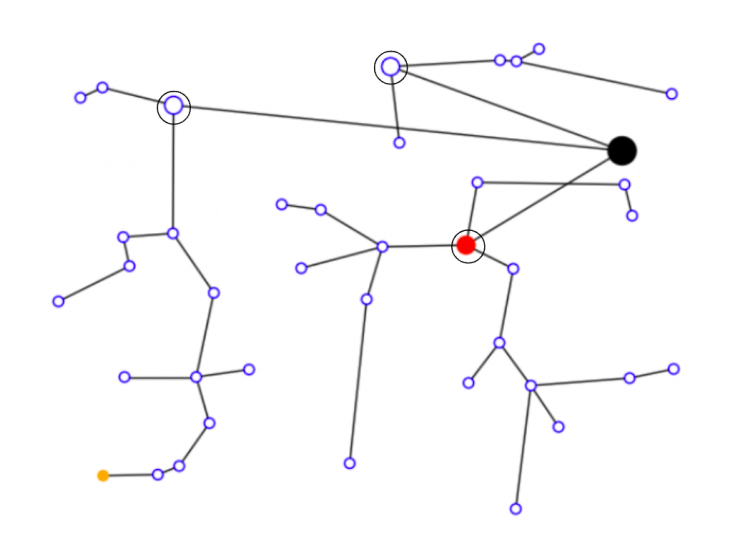

<h1 align="center">Multi-Source Prim-Dijkstra</h1>

This repository contains the work for the Multi-Source Prim-Dijkstra contest "entry". In the `contest` [folder](https://github.com/EmilyOng/mspd/tree/main/contest):
- [mspd.py](https://github.com/EmilyOng/mspd/blob/main/contest/mspd.py): Our implementation of the MSPD heuristic in accordance with the original implementation in C++ [here](https://github.com/TILOS-AI-Institute/Multi-Source-Prim-Dijkstra/blob/main/src/STT/MSPD/STT.cpp). This is primarily used to produce objective values (i.e., normalized wirelength and skew) in the agent procedures.
- [local_search.py](https://github.com/EmilyOng/mspd/blob/main/contest/local_search.py): Our implementation of local search.
- [qlearning.py](https://github.com/EmilyOng/mspd/blob/main/contest/qlearning.py): Our implementation of Q-Learning with local search refinement.

- [inference.py](https://github.com/EmilyOng/mspd/blob/main/contest/inference.py): Provided driver code for the contest.
- [contest.md](https://github.com/EmilyOng/mspd/blob/main/contest/contest.md): Provided description of the contest.
